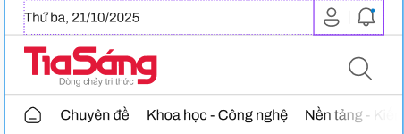
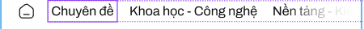

Main 
{
    // RESPONSIVE - Tự động scale cho mọi mobile device
    width: 100%; // Chiếm full width
    max-width: 100%;
    
    // Breakpoints:
    // @414px: height ≈ 143px (ratio 35%)
    // @720px: height ≈ 252px (ratio 35%)
    height: 35vw; // Tỷ lệ chiều cao so với width (responsive)
    min-height: 120px;
    
    background: #FFF;
    padding: 12px 16px; // Padding responsive
    box-sizing: border-box;
    
    Header 
    {   
        width: 100%;
        
        Frame date - logo - [login box+alert] /Header 1
        {
             
            display: inline-flex;
            justify-content: space-between;
            align-items: center;
            width: 100%;
            margin-bottom: 12px;
            
            "Thứ ba, 21/10/2025" //Date (left)
            {
                color: var(--text-regular, #202020);
                
                // Scale tuyến tính dựa theo viewport width
                font-family: Archivo;
                font-size: clamp(12px, 3.4vw, 16px); // Min 12px, ideal 3.4vw, max 16px
                font-style: normal;
                font-weight: 400;
                line-height: 140%;
                white-space: nowrap;
            }

            frame login + alert  //Right
                
            {   
                display: flex;
                align-items: center;
                gap: 8px;

                person/alert icon
                {   
                    width: clamp(20px, 5.8vw, 28px);
                    height: clamp(20px, 5.8vw, 28px);
                    flex-shrink: 0;
                }

                line
                {
                    width: 1px;
                    height: clamp(12px, 3vw, 16px);
                    background: var(--border-subdued, #D6D6D6);
                }
            }
        }

        frame logo + search
        {
            display: flex;
            width: 100%;
            justify-content: space-between;
            align-items: center;
            gap: 12px;
            margin-bottom: 8px;

           //Logo - Left
            {
                // Logo: 138px @ 414px → 240px @ 720px
                width: clamp(110px, 33.3vw, 260px);
                height: auto;
                flex-shrink: 0;
                aspect-ratio: 46/15; // Giữ aspect ratio
            }

            search icon - Right
            {
                width: clamp(20px, 5.8vw, 28px);
                height: clamp(20px, 5.8vw, 28px);
                aspect-ratio: 1/1;
                flex-shrink: 0;
            }
        }
        
        category bar(Chuyên đề ; Khoa học - Công nghệ ; Văn hóa - Xã hội ; Nền tảng - Kiến tạo ; Diễn đàn ; Hồ sơ - Nhân vật)
         
        {
            display: flex;
            width: calc(100% + 32px); // Extend beyond padding
            margin: 0 -16px; // Compensate padding
            padding: 0 16px;
            overflow-x: auto;
            overflow-y: hidden;
            -webkit-overflow-scrolling: touch;
            
            gap: clamp(12px, 3.8vw, 20px);
            position: sticky;
            top: 0;
            z-index: 10;
            
            Mô tả thêm: Thanh trượt ngang category, sticky khi cuộn
            
            home icon
            {
                width: clamp(16px, 4.8vw, 22px);
                height: clamp(16px, 4.8vw, 22px);
                flex-shrink: 0;
            }
            
            one category
            {
                color: var(--title, #101010);
                font-family: Archivo;
                font-size: clamp(13px, 3.8vw, 16px);
                font-style: normal;
                font-weight: 400;
                line-height: 160%;
                white-space: nowrap;
                flex-shrink: 0;
            }
        }

        Background //Nhầm lẫn thiết kế, đây không phải header
        {
            width: 100%;
            height: auto;
            aspect-ratio: 16/5; // Responsive aspect ratio
            min-height: 250px;

            background: url(<path-to-image>) lightgray 50% / cover no-repeat;
            display: flex;
            flex-direction: column;
            justify-content: center;
            padding: 32px 16px;
            box-sizing: border-box;

            
            "Nền tảng - Kiến tạo"
            {
                color: var(--text-regular, #202020);
                font-family: Merriweather;
                
                // Responsive font scaling
                font-size: clamp(18px, 5.3vw, 32px);
                font-style: normal;
                font-weight: 700;
                line-height: 160%;
                margin: 0;
                margin-bottom: 12px;
            }
            
            line
            {
                width: clamp(80px, 24vw, 140px);
                height: 2px;
                background: var(--2, #E21939);
            }
        }
    }

}

// ============================================================
// RESPONSIVE SCALING REFERENCE
// ============================================================

// Thiết bị: 414px (iPhone SE/13 mini)
// Header height: 143px

// Thiết bị: 720px (Tablet Android)
// Header height: ~252px (tự động scale từ 35vw)

// Công thức: vw unit tự động tính từ viewport width
// 5.8vw @ 414px ≈ 24px ✓
// 5.8vw @ 720px ≈ 42px (scale tương ứng)

// Padding & Gap: clamp(min, ideal, max)
// - Giữ minimum trên thiết bị nhỏ
// - Scale smooth lên thiết bị lớn
// - Prevent quá lớn trên thiết bị rất lớn

// Aspect ratio: Giữ tỷ lệ logo, icon bất kể screen size