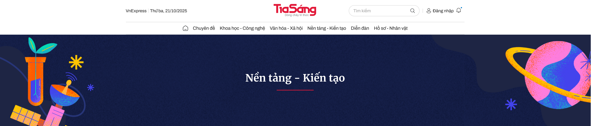
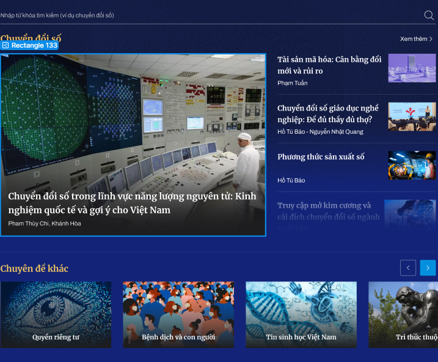
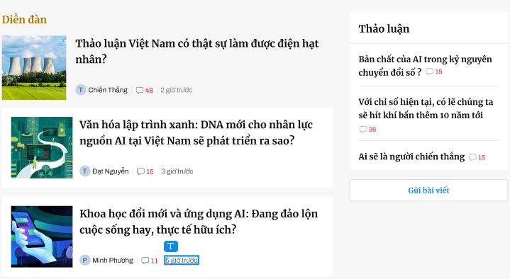

 //Hình ảnh bố cục tổng quan 
Main
{
    display: flex;
    width: 1098px;
    justify-content: space-between;
    align-items: center;
    margin: 0 auto;
    padding: 15px 0;)

    Header 
    {   
        width: 1100px;
        Frame date - logo - [search box + login box] /Header 1
        {
            (display: flex;
            width: 1098px;
            justify-content: space-between;
            align-items: center;
            margin: 0 auto;
            padding: 15px 0;)

            "Thứ ba, 21/10/2025" //Date (left)
            {
                color: var(--text-regular, #202020);

                /* 14/140/re */
                font-family: Archivo;
                font-size: 14px;
                font-style: normal;
                font-weight: 400;
                line-height: 140%; /* 19.6px */
            }

           //Logo
            {
                width: 138px;
                height: 45px;
                aspect-ratio: 46/15;
                position: absolute;
                left: 50%;
                transform: translateX(-50%);
            }
            frame search - login  //Right
                
            {   
                display: inline-flex;
                align-items: center;
                gap: 10px;

                search box
                {   
                    width: 230px;
                    height: 36px;
                    border-radius: 30px;
                    border: 1px solid var(--border-subdued, #D6D6D6);
                    background: #FFF;
                    

                    "Tìm kiếm"
                    {
                        color: var(--text-subdued-lighter, #9F9F9F);

                        /* 14/160 */
                        font-family: Archivo;
                        font-size: 14px;
                        font-style: normal;
                        font-weight: 400;
                        line-height: 160%; /* 22.4px */
                    }

                     Search Icon
                    {
                        width: 14.4px;
                        height: 14.4px;
                        aspect-ratio: 14.40/14.40;
                    }
                }

                line
                {
                    width: 1px;
                    height: 14px;

                    background: var(--border-subdued, #D6D6D6);
                }

                login box  //Hình ảnh bố cục login box
                {
                    display: flex;
                    align-items: center;
                    gap: 9px;

                     //Login icon
                    {
                        display: flex;
                        align-items: center;
                        gap: 3px;
                    }
                    "Đăng nhập"
                    {
                        color: var(--text-regular, #202020);

                        /* 14/160 */
                        font-family: Archivo;
                        font-size: 14px;
                        font-style: normal;
                        font-weight: 400;
                        line-height: 160%; /* 22.4px */
                    }

                     //Alert icon
                    {
                        width: 20px;
                        height: 20px;
                    }
                }
            }
        }

        frame danh mục // Header 2
        {
            display: flex;
            width: 1098px;
            justify-content: center;
            align-items: center;
            gap: 15px;

             //Home icon
            {
                width: 18px;
                height: 18px;
                flex-shrink: 0;
            }

            "Chuyên đề"; "Khoa học - Công nghệ"; ...
            {
                color: var(--text-regular, #202020);
                text-align: center;

                /* lead 15 */
                font-family: Archivo;
                font-size: 15px;
                font-style: normal;
                font-weight: 400;
                line-height: 160%; /* 24px */
            }
        }
        Background // Header 3 
        {
            width: 1920px;
            height: 300px;

            background: url(<path-to-image>) lightgray 50% / cover no-repeat;

            
            "Nền tảng - Kiến tạo"
            {
                color: #FFF;
                font-family: Merriweather;
                font-size: 33px;
                font-style: normal;
                font-weight: 700;
                line-height: 160%; /* 52.8px */
            }
            line
            {
                width: 120px;
                height: 2px;

                background: var(--2, #E21939);
            }
        }
    }

}