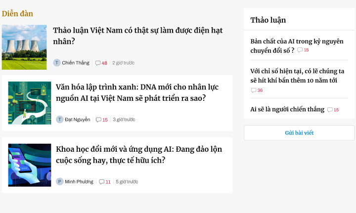
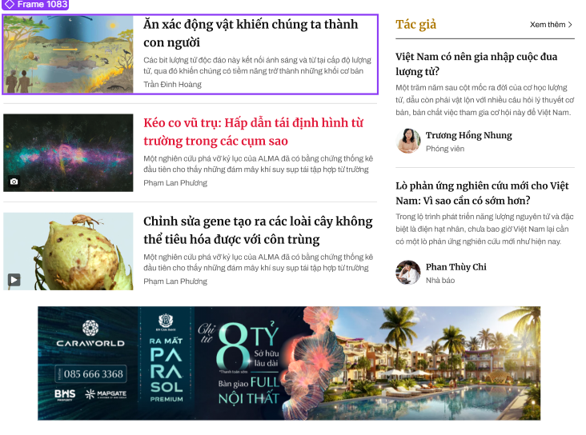
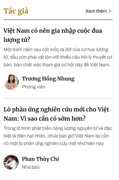

đây không phải ngôn ngữ lập trình nào! đây là giả mã mô phỏng cấu trúc giao diện web, gồm cách cấu trúc, các mô tả, các css liên quan
Rule:
    Fontsize kế thừa những fontsize tương tự đã có
    Hiện đang dùng kích thước tuyệt đối áp dụng cho width 1100px, nếu có thay đổi kích thước thì sẽ điều chỉnh lại kích thước tuyệt đối cho phù hợp

//Các thành phần thường xuyên sử dụng:
    line
    {
        heigh 1px;

        background: var(--border-subdued, #D6D6D6);
        or
        background: #101010;
    }

SECTION type 1:  [TiaSang_FE/details_figma/Frame 230890.png]
{
    [Featured Article Large]
    {
        Background Image
        {
            width: 720px;
            height: 720px;
            aspect-ratio: 1/1;
            object-fit: cover;

            Text(//text được ghi trên ảnh, sát lề dưới, chỗ có text sẽ làm mờ ảnh bằng màu đen
                Title
                Description
                Author
                Date
            )

        }

    }

    Others of Top Stories[2 units]
    {
        width: 345px;
        height: 306px;

        Story Background Image
        {
            width: 345px;
            height: 207px;
            aspect-ratio: 5/3;
        }
        Text(//Text nằm ngoài ảnh, nằm bên dưới ảnh
            Title
            Author
            Date
            Comment Count + icon
        )
    }
    [Feature Quote]
    {
        width: 1100px;
        height: 169px;

        quote mark icon
        {
            width: 163px;
            height: 163px;
            aspect-ratio: 1/1;
        }
        Quote Text
        Author
        Details Navigation
    } 
}

SECTION type 2: 
{
    Color màu tím than
    
    Text - Name of Section // Căn lề trái
    {
        color: var(--3, #F4C660);

        /* Mer/22/bold */
        font-family: Merriweather;
        font-size: 22px;
        font-style: normal;
        font-weight: 700;
        line-height: 160%; /* 35.2px */
    }

    Search Bar /
    {   
        display: flex;
        width: 1100px;
        height: 24px;
        align-items: center;
        gap: 10px;

        Input Field
        Search Button
        {
            width: 24px;
            height: 24px;
        }
    }

    readmore navigation // Ngang với Name of Section, căn lề phải
    {
        color: #FFF;
        font-family: Archivo;
        font-size: 15px;
        font-style: normal;
        font-weight: 400;
        line-height: 160%; /* 24px */
    }
    Main Content
    {
        display: flex;
        align-items: center;
        gap: 30px;
        align-self: stretch;

        Article Item[Featured] //nằm bên phải
        {
            Background Image
            {
                width: 670px;
                height: 461px;

                Text(text được ghi trên ảnh, sát lề dưới, chỗ có text sẽ làm mờ ảnh bằng màu đen
                    Title
                    Author
                )
            }

        }
        Article Item Scroll list[Standard] //nằm bên trái, chỉ cần scroll dọc, ẩn thanh scroll
        {
            display: flex;
            width: 400px;
            flex-direction: column;
            align-items: flex-start;
            gap: 20px;

            unit item
            {
                display: flex;
                width: 400px;
                heigh: 83px;
                align-items: flex-start;
                gap: 10px;
                Text( //left side
                    Title
                    {   
                        height: 57px;
                        align-self: stretch;

                        color: #FFF;

                        /* 18/bold */
                        font-family: Merriweather;
                        font-size: 18px;
                        font-style: normal;
                        font-weight: 700;
                        line-height: 160%; /* 28.8px */
                    }
                    Author
                    {
                        width: 260px;
                        height: 20px;

                        color: #FFF;

                        /* 18/bold */
                        font-family: Merriweather;
                        font-size: 18px;
                        font-style: normal;
                        font-weight: 700;
                        line-height: 160%; /* 28.8px */
                    }
                )
                image //right side; có ảnh!
                {
                    width: 120px;
                    height: 72px;
                    flex-shrink: 0;
                    aspect-ratio: 5/3;
                }
            }
        } 
    }
    Sub Content
    {
        display: flex;
        flex-direction: column;
        align-items: flex-start;
        gap: 15px;
        align-self: stretch;

        Text "Chuyên đề khác"

        List of Categories[Carousel] //Cuộn ngang, chỉ cần cuộn ngang, không cần cuộn dọc, ẩn các thanh cuộn
        {   
            display: flex;
            width: 1100px;
            height: 168px;
            align-items: center;
            gap: 30px;

            Category Item unit
            {
                Image
                {
                    width: 280px;
                    height: 168px;

                    Text{
                        color: #FFF;
                        text-align: center;

                        /* Merri 16/160/bold */
                        font-family: Merriweather;
                        font-size: 16px;
                        font-style: normal;
                        font-weight: 700;
                        line-height: 160%; /* 25.6px */
                    }
                }
            }
        }
    }
}

Forum SECTION type 3: 
{
    [Main List]
    {
        text;
        List of Posts
        {
            display: flex;
            width: 720px;
            flex-direction: column;
            align-items: flex-start;
            gap: 20px;
            flex-shrink: 0;

            Forum Topic Item
            {   
                display: flex;
                width: 720px;
                align-items: flex-start;
                gap: 20px;

                Image Post
                {
                    width: 140px;
                    height: 140px;
                    flex-shrink: 0;
                    aspect-ratio: 1/1;
                }
                Title
                {
                    531*100px

                    color: var(--title, #101010);

                    /* Mer/22/bold */
                    font-family: Merriweather;
                    font-size: 22px;
                    font-style: normal;
                    font-weight: 700;
                    line-height: 160%; /* 35.2px */
                }
                Other;
                {
                    height 24px

                    display: flex;
                    align-items: center;
                    gap: 8px;

                    Avatar Author
                    {
                        display: flex;
                        width: 12px;
                        height: 16px;
                        flex-direction: column;
                        justify-content: center;
                    }

                    AuthorText
                    {
                        color: var(--Gray-222222, #222);
                        font-family: Archivo;
                        font-size: 15px;
                        font-style: normal;
                        font-weight: 400;
                        line-height: 140%; /* 21px */
                    }

                    Comment Count + icon
                    {
                        //font giống AuthorText
                    }
                    Date
                    {
                        color: #7F7F7F;
                        font-family: Archivo;
                        font-size: 15px;
                        font-style: normal;
                        font-weight: 400;
                        line-height: 100%; /* 15px */
                    }
                }
            }
        }
        
    }
    [Sub]
    {   
        display: flex;
        width: 345px;
        flex-direction: column;
        align-items: flex-start;
        gap: 20px;
        flex-shrink: 0;

        list
        {   
            width 345px;

            text - Name of Sub List - "Thảo luận" //right side
            {
                color: var(--title, #101010);

                /* Mer/22/bold */
                font-family: Merriweather;
                font-size: 22px;
                font-style: normal;
                font-weight: 700;
                line-height: 160%; /* 35.2px */
            }
            List of Posts [3 units]
            {
                Post Item
                {
                    width 305px;

                    Title
                    {
                        color: var(--title, #101010);

                        /* 18/bold */
                        font-family: Merriweather;
                        font-size: 18px;
                        font-style: normal;
                        font-weight: 700;
                        line-height: 160%; /* 28.8px */
                    }
                    Comment Count
                }
            }
        }

        Button - Create New Post
    }
}

SECTION type 4: 
{
    [Main List]
    {
        List of Posts //giống list bài viết trong trang "Nền tảng - Kiến tạo đã có"
        {
            Forum Topic Item
            {   
                Image Post
                Title
                Short Description
                Author
            }
        }
        
    }
    [Sub content] 
    {   
        display: flex;
        width: 345px;
        flex-direction: column;
        align-items: flex-start;
        gap: 20px;
        flex-shrink: 0;

        text - Name of Sub List //Lề trái
        {
            color: var(--31, #AD7701);

            /* Mer/22/bold */
            font-family: Merriweather;
            font-size: 22px;
            font-style: normal;
            font-weight: 700;
            line-height: 160%; /* 35.2px */
        }
        Read More Button // Lề phải
        {
            color: var(--title, #101010);
            font-family: Archivo;
            font-size: 15px;
            font-style: normal;
            font-weight: 400;
            line-height: 160%; /* 24px */
        }

        List of Posts
        {
            Post Item
            {   
                display: flex;
                width: 345px;
                flex-direction: column;
                align-items: flex-start;
                gap: 20px;

                line

                [Title
                Short Description]
                {
                    display: flex;
                    flex-direction: column;
                    align-items: flex-start;
                    gap: 5px;

                    Title
                    {   
                        height 57px;

                        color: var(--title, #101010);

                        /* 18/bold */
                        font-family: Merriweather;
                        font-size: 18px;
                        font-style: normal;
                        font-weight: 700;
                        line-height: 160%; /* 28.8px */
                    }

                    Short Description
                    {   
                        height 71px;

                        color: var(--text-article-lead, #5F5F5F);

                        /* lead 15 */
                        font-family: Archivo;
                        font-size: 15px;
                        font-style: normal;
                        font-weight: 400;
                        line-height: 160%; /* 24px */
                    }
                }
                [Avatar Author
                Author Info]
                {
                    display: flex;
                    align-items: flex-start;
                    gap: 10px;
                    align-self: stretch;

                    Avatar Author
                    {
                        width: 48px;
                        height: 48px;
                        flex-shrink: 0;
                        aspect-ratio: 1/1;

                        border-radius: 48px;
                        background: url(<path-to-image>) lightgray 50% / cover no-repeat;
                    }

                    Author Info
                    {
                        display: flex;
                        width: 242px;
                        height: 56px;
                        flex-direction: column;
                        align-items: flex-start;
                        gap: 2px;
                        flex-shrink: 0;

                        AuthorName
                        {
                            color: var(--title, #101010);

                            /* Merri 16/160/bold */
                            font-family: Merriweather;
                            font-size: 16px;
                            font-style: normal;
                            font-weight: 700;
                            line-height: 160%; /* 25.6px */
                        }

                        AuthorJob
                        {
                            color: var(--text-article-lead, #5F5F5F);

                            /* Title tác giả */
                            font-family: Archivo;
                            font-size: 15px;
                            font-style: normal;
                            font-weight: 400;
                            line-height: 140%; /* 21px */
                        }
                    }
                }
            }
        }
        Ads Banner
        {
            width: 970px;
            height: 223px;

        }
    }
}

SECTION type 5:
{
    display: flex;
    height: 707px;
    flex-direction: column;
    align-items: flex-start;
    gap: 15px;

   [NameText + Xem thêm]
   {
        display: flex;
        width: 1100px;
        justify-content: space-between;
        align-items: center;

        NameText "Khoa học và Công nghệ"
        {
            color: var(--31, #AD7701);
            font-family: Merriweather;
            font-size: 22px;
            font-style: normal;
            font-weight: 700;
            line-height: 160%; /* 35.2px */
        }

        "Xem thêm"{
            color: var(--title, #101010);
            font-family: Archivo;
            font-size: 15px;
            font-style: normal;
            font-weight: 400;
            line-height: 160%; /* 24px */
        }
   }
    Content
    {
        display: flex;
        width: 1100px;
        height: 640px;
        justify-content: space-between;
        align-items: flex-start;
        flex-shrink: 0;

        Featured Article
        {
            display: flex;
            width: 720px;
            flex-direction: column;
            align-items: flex-start;
            gap: 15px;
            flex-shrink: 0;
            
            Background Image
            Text(
                Title
                Description
                Author
            )
        }
        Others Articles[2 units]
        {
            Image
            Text(
                Title
                Author
            )
        }
    }
}

SECTION type 6:
{
    Read More Button;
    Featured Article List
    {
        Article Item
        {
            Background Image
            Text(
                Title
                Author
            )
        }
    }
}

SECTION type 7:
{   
    Text - Name
    Navigation Button

    Article List
    {
        uint Article Item
        {
            Image
            Text(
                Title
            )
        }
    }

}
SECTION type 8:
{
    Category type 1
    {
        Named Category;
        Readmore Button
        Article Unit[2 units]
        {
            Image
            Text(
                Title
                Author
            )
        }
    }
    Category type 2
    {
        Named Category;
        Readmore Button
        Article Unit[1 units]
        {
            Image
            Text(
                Title
                Short Description
            )
        }
    }
    Sidebar Ads Banner
}