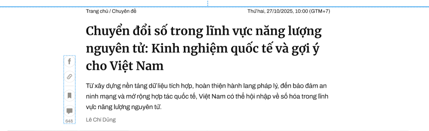

body
Done {
    width 1100px;

    review post //
    {   
        {
            display: flex;
            justify-content: space-between;
            align-items: center;
            align-self: stretch;

            "Trang chủ > Chuyên đề"//Text + Link
            (1){
                color: var(--title, #101010);
                font-family: Archivo;
                font-size: 14px;
                font-style: normal;
                font-weight: 400;
                line-height: 160%; /* 22.4px */
            }

            "Thứ hai, 27/10/2025, 10:00 (GTM+7)"//Time
            {
                Tương tự (1)
            }
        }
        content
        {   
            display: flex;
            flex-direction: column;
            align-items: flex-start;
            gap: 15px;

            tile
            {
                width: 670px;

                color: var(--title, #101010);
                font-family: Merriweather;
                font-size: 32px;
                font-style: normal;
                font-weight: 700;
                line-height: 150%; /* 48px */
            }
            more
            {
                display: flex;
                flex-direction: column;
                align-items: flex-start;
                gap: 10px;

                shortDecription
                {
                    color: var(--title, #101010);

                    /* 18/lead/archi */
                    font-family: Archivo;
                    font-size: 18px;
                    font-style: normal;
                    font-weight: 400;
                    line-height: 160%; /* 28.8px */
                }
                author
                {
                    width: 670px;
                    color: var(--text-article-lead, #5F5F5F);

                    /* Title tác giả */
                    font-family: Archivo;
                    font-size: 15px;
                    font-style: normal;
                    font-weight: 400;
                    line-height: 140%; /* 21px */
                }
            }
        }
    }
    detailsPost
    {
        //DetailsPost không có cấu trúc cố định nhưng có các thành phần cố định bao gồm

        imageSide
        {
            image
            {
                lấy width là 100%, crop ảnh, không làm ảnh bị bẹp hay kéo dài
                link-to-image
            }
            imageName
            {
                height: 29px;
                align-self: stretch;

                color: var(--text-article-lead, #5F5F5F);
                text-align: center;
                font-family: Archivo;
                font-size: 18px;
                font-style: italic;
                font-weight: 400;
                line-height: 160%; /* 28.8px */
            }
        }
        line // bố cục hóa, trang trí, ngăn cách đoạn, vv
        {
            width: 670px;
            height: 1px;

            background: #E21939;//Có thể tùy chọn sao cho sẫm hơn màu nền
        }

        textP // Đoạn văn bản thường
        {
            width: 670px
            align-self: stretch;

            color: var(--title, #101010);

            /* 18/lead/archi */
            font-family: Archivo;
            font-size: 18px;
            font-style: normal;
            font-weight: 400;
            line-height: 160%; /* 28.8px */
        }
        textB // Văn bản in đậm/chủ đề đoạn
        {
            color: var(--title, #101010);
            font-family: Archivo;
            font-size: 24px;
            font-style: normal;
            font-weight: 700;
            line-height: 160%; /* 38.4px */
        }
        navigation //Cuối bài viết //
        {
            {
                display: flex;
                width: 82px;
                align-items: flex-start;
                gap: 10px;
                flex-shrink: 0;

                turnBack icon;
                bookmark icon;
            }
            social icons.
            {
                display: flex;
                width: 128px;
                align-items: flex-start;
                gap: 10px;
                flex-shrink: 0;
                3 icons
            }
        }
    }
    comment-section{
        display: flex;
        width: 670px;
        flex-direction: column;
        align-items: flex-start;
        gap: 20px;

        Text// "Ý kiến/Bình luận (%số bình luận%)" //Bên trái
        {
            color: #000;

            /* Mer/22/bold */
            font-family: Merriweather;
            font-size: 22px;
            font-style: normal;
            font-weight: 700;
            line-height: 160%; /* 35.2px */
        }
        {
            inputTextBox
            {
                width: 670px;
                height: 48px;

                border-radius: 3px;
                border: 1px solid var(--gray-e5e5e5, #E5E5E5);
                background: #FFF;
                {
                    shadowText "Chia sẻ ý kiến của bạn"//left
                    {
                        color: #757575;

                        /* Detail / comment / input reg */
                        font-family: Arial;
                        font-size: 15px;
                        font-style: normal;
                        font-weight: 400;
                        line-height: 150%; /* 22.5px */
                    }
                    iconBox{
                        width: 18px; //Right
                        height: 18px;
                    }

                }
            }
            Filter "Quan tâm nhất| Mới nhất"
            {
                height: 28px;
                align-self: stretch;

                Tabs Text
                {
                    color: var(--Primary, #9F224E);
                    font-family: Arial;
                    font-size: 15px;
                    font-style: normal;
                    font-weight: 700;
                    line-height: normal;
                }
            }
            CommentList
            {
                Một comment thường có: Comment chính, reply, và more

                commentOption
                {
                    xếp hàng ngang, căn trái cách đều khoảng 20px(ví dụ)

                    color: var(--Gray-757575, #757575);

                    /* Detail / comment / meta tool */
                    font-family: Arial;
                    font-size: 13px;
                    font-style: normal;
                    font-weight: 400;
                    line-height: normal;
                    {
                        likecount
                        iconLike
                    }
                    "Trả lời"
                    "Chia sẻ"
                    Time
                }
                mainComment
                {
                    AvatarUser
                    UserName
                    commentText
                    commentOption

                    replyComment(nếu có);

                    "x trả lời"
                    {
                        icon
                        
                        color: var(--Secondary---Light, #076DB6);

                        /* Detail / comment / meta tool bold */
                        font-family: Arial;
                        font-size: 13px;
                        font-style: normal;
                        font-weight: 700;
                        line-height: normal;
                    }
                }
                replyComment
                {
                    lùi vào một chút;
                    có line dọc 2px;
                    kế thừa mainComment;
                }
            }
            "Xem thêm" Box
            {
                display: inline-flex;
                height: 40px;
                padding: 10px 120px;
                justify-content: center;
                align-items: center;
                gap: 10px;

                color: var(--text-article-lead, #5F5F5F);
                font-family: Archivo;
                font-size: 14px;
                font-style: normal;
                font-weight: 400;
                line-height: 160%; /* 22.4px */
            }
        }
    }
    TagSection //VD "Tags:  Khoa học Công nghệ / Chuyển đổi số / Điện toán đám mây"
    {
        align-self: stretch;

        color: var(--text-regular-lighter, #5F5F5F);
        font-family: Archivo;
        font-size: 15px;
        font-style: normal;
        font-weight: 400;
        line-height: 160%; /* 24px */
    }
}
Update
body{
    //Sau "xem thêm là list tin"
    Cấu trúc giống list tin trong "Nền tảng, kiến tạo"
    
      <!-- Body 2: Main Content + Sidebar -->
      ...
}

