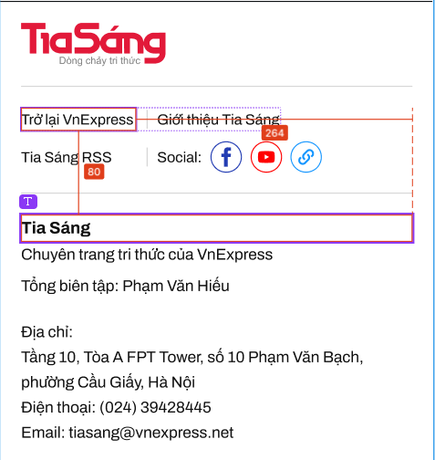
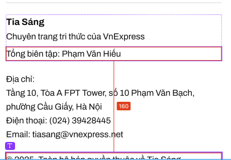

//footer details  

footer
{
    width: 720px;
    height: 855px;

    line
    {
        width: 720px;
        height: 1px;
        background: var(--icon-fill-on-white, #0D1013);
    }

    taskbar danh mục // Footer 1 
    {
        Ẩn
    }
    footer 2
    {
        width: 720px;
        height: 346px;

        line
        {
            width: 720px;
            height: 1px;

            background: var(--border-subdued, #D6D6D6);
        }
        
        content-footer2
        {
            content1
            {
                 //lề trái
                {
                    width: 241px;
                    height: 79px;
                    flex-shrink: 0;
                    aspect-ratio: 46/15;
                }
            }

            navigation
            {
                display: flex;
                width: 537px;
                align-items: center;
                gap: 17px;
                flex-shrink: 0;

                "Trở lại Vnexpress"/ "Giới thiệu Tia Sáng" / "Tia Sáng RSS" / "Social" xếp 2*2, cột cách nhau bởi gạch dọc
                {

                    text
                    {
                        color: var(--text-regular, #202020);

                        /* lead 15 */
                        font-family: Archivo;
                        font-size: 26px;
                        font-style: normal;
                        font-weight: 400;
                        line-height: 160%; /* 24px */
                    }

                    line
                    {
                        width: 1px;
                        height: 24px;

                        background: var(--border-subdued, #D6D6D6);
                    }
                }

                Social: FB/Youtube/Link // cũng là 1 phần navigation, ngăn cách bởi line
                {
                    width: 274px;
                    height: 52px;

                    "Social"
                    {
                        display: flex;
                        width: 84px;
                        height: 24px;
                        flex-direction: column;
                        justify-content: center;

                        color: var(--text-regular, #202020);

                        /* lead 15 */
                        font-family: Archivo;
                        font-size: 26px;
                        font-style: normal;
                        font-weight: 400;
                        line-height: 160%; /* 24px */
                    }
                    icon-unit // Facebook/Youtube/Link
                    {
                        rectangle
                        {
                            width: 52px;
                            height: 52px;

                            border-radius: 80px;
                            border: 1px solid #233DB3;
                            background: #FFF;
                        }
                        icon-social
                        {
                            ...
                        }
                    }
                }
            }
        }
        line
        {
            width: 720px;
            height: 1px;

            background: var(--border-subdued, #D6D6D6);
        }
        content-footer-3 
        {
            details-1
            {
                text-1 //Các text được viết căn lề phải
                {

                    "Tia Sáng"
                    {
                        width: 724px;

                        color: var(--text-regular, #202020);
                        font-family: Archivo;
                        font-size: 28px;
                        font-style: normal;
                        font-weight: 700;
                        line-height: 160%; /* 25.6px */
                    }

                    "Chuyên trang tri thức của VnExpress"
                    {
                        width: 724px;

                        color: var(--text-regular, #202020);

                        /* 14/140/re */
                        font-family: Archivo;
                        font-size: 24px;
                        font-style: normal;
                        font-weight: 400;
                        line-height: 140%; /* 19.6px */
                    }
                }
                text2-"Tổng biên tập: Phạm Văn Hiếu"
                {
                    align-self: stretch;

                    color: var(--text-regular, #202020);

                    /* lead 15 */
                    font-family: Archivo;
                    font-size: 26px;
                    font-style: normal;
                    font-weight: 400;
                    line-height: 160%; /* 24px */
                }
            }

            details-2 "Địa chỉ: Tầng 10, Tòa A FPT Tower,  số 10 Phạm Văn Bạch, phường Cầu Giấy, Hà Nội Điện thoại: (024) 39428445 Email: tiasang@vnexpress.net"
            {
                width: 674px;

                display: flex;
                flex-direction: column;
                align-items: flex-start;
                gap: 3px;
                flex: 1 0 0;

                color: var(--text-regular, #202020);

                /* lead 15 */
                font-family: Archivo;
                font-size: 26px;
                font-style: normal;
                font-weight: 400;
                line-height: 160%; /* 24px */
            }

            details-3 "© 2025. Toàn bộ bản quyền thuộc về Tia Sáng"
            {
                width: 537px;

                color: var(--text-regular, #202020);
                text-align: right;

                /* lead 15 */
                font-family: Archivo;
                font-size: 26px;
                font-style: normal;
                font-weight: 400;
                line-height: 160%; /* 24px */
            }
        }
    }
}