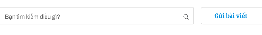
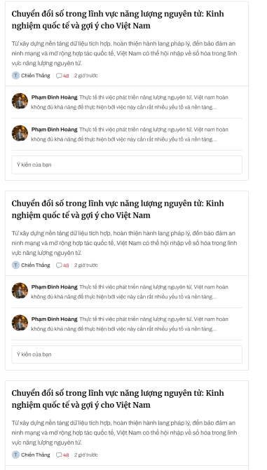
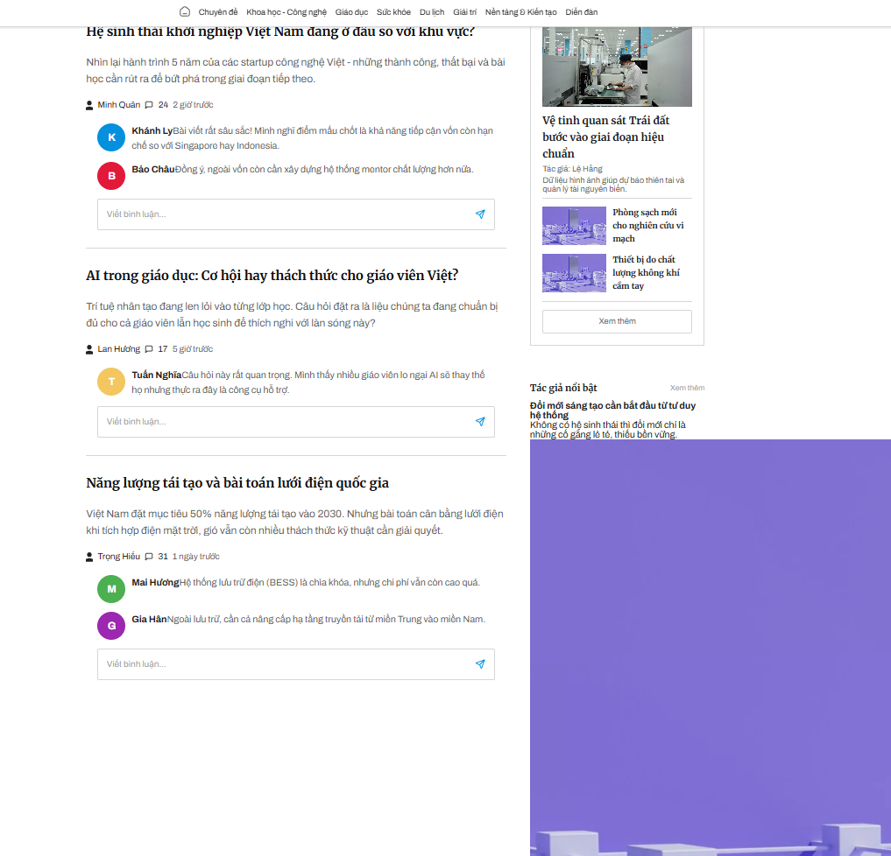

header và footer chung

###Done
body //Trang "Diễn đàn"
{
    banner{
        tương tự banner của "nền tảng kiến tạo"
    }
    action box 
    {   
        display: flex;
        width: 720px;
        align-items: center;
        gap: 20px;

        searchBox //Left
        {
            display: flex;
            width: 530px;
            height: 48px;
            padding: 15px 0 0 15px;
            flex-direction: column;
            align-items: flex-start;
            gap: 3px;
            flex-shrink: 0;

            shadowText
            searchIcon
        }
        button "Gửi bài viết" //Right
        {
            width: 170px;
            height: 48px;

            border-radius: 5px;
            border: 1px solid var(--border-subdued, #D6D6D6);
            background: #FFF;

            text
            {
                color: #0590DE;

                /* Merri 16/160/bold */
                font-family: Merriweather;
                font-size: 16px;
                font-style: normal;
                font-weight: 700;
                line-height: 160%; /* 25.6px */
            }
        }
    }
    ListPost //Cấu tạo bởi các post đơn lẻ. 
    {
        display: flex;
        width: 720px;
        flex-direction: column;
        align-items: center;
        gap: 30px;

        unitPost
        {
            display: flex;
            width: 720px;
            flex-direction: column;
            align-items: center;
            gap: 20px;

            postContent
            {
                display: flex;
                flex-direction: column;
                align-items: flex-start;
                gap: 20px;
                align-self: stretch;

                title
                {
                    color: var(--title, #101010);

                    /* Mer/22/bold */
                    font-family: Merriweather;
                    font-size: 22px;
                    font-style: normal;
                    font-weight: 700;
                    line-height: 160%; /* 35.2px */
                }
                shortDecription
                {
                    color: var(--text-article-lead, #5F5F5F);

                    /* 18/lead/archi */
                    font-family: Archivo;
                    font-size: 18px;
                    font-style: normal;
                    font-weight: 400;
                    line-height: 160%; /* 28.8px */
                }
                info //left
                {
                    display: flex;
                    align-items: center;
                    gap: 8px;

                    avatarAuthor
                    {
                        display: flex;
                        width: 12px;
                        height: 16px;
                        flex-direction: column;
                        justify-content: center;
                    }
                    authorName
                    {
                        color: var(--Gray-222222, #222);
                        font-family: Archivo;
                        font-size: 15px;
                        font-style: normal;
                        font-weight: 400;
                        line-height: 140%; /* 21px */
                    }
                    iconComment{}
                    commentCount
                    {
                        color: var(--Gray-222222, #222);
                        font-family: Archivo;
                        font-size: 15px;
                        font-style: normal;
                        font-weight: 400;
                        line-height: 140%; /* 21px */
                    }
                    time
                    {
                        color: #5F5F5F;
                        font-family: Archivo;
                        font-size: 15px;
                        font-style: normal;
                        font-weight: 400;
                        line-height: 100%; /* 15px */
                    }
                }
            }
            commentList
            {
                display: flex;
                width: 680px;
                flex-direction: column;
                align-items: flex-start;
                gap: 15px;

                unitComment
                {
                    width: 679px;

                    avatar //left, up
                    {
                        width: 48px;
                        height: 48px;
                        flex-shrink: 0;
                        aspect-ratio: 1/1;
                        border-radius: 48px;
                    }
                    {
                        userName + textComment ///Viết nối nhau
                        {
                            userName
                            {
                                color: var(--text-article-title, #202020);
                                font-family: Archivo;
                                font-size: 16px;
                                font-style: normal;
                                font-weight: 700;
                                line-height: 160%; /* 25.6px */
                            }
                            textComment
                            {
                                color: var(--text-article-lead, #5F5F5F);
                                font-family: Archivo;
                                font-size: 16px;
                                font-style: normal;
                                font-weight: 400;
                                line-height: 160%; /* 25.6px */
                            }
                        }
                    }
                }
                inputComment
                {   
                    display: flex;
                    height: 54px;
                    padding: 15px 0 0 15px;
                    flex-direction: column;
                    align-items: flex-start;
                    gap: 3px;
                    align-self: stretch;
                    border-radius: 3px;
                    border: 1px solid var(--border-subdued, #D6D6D6);
                    background: var(--General-White, #FFF);

                    shadowText //left
                    sendBut //right
                }
            }
        }
    }
    rightSideBar //tái sử dụng các thành phần đã có 
    {
        display: flex;
        width: 299.456px;
        flex-direction: column;
        align-items: flex-start;
        gap: 30px;

        thẻ sidebar tương tự "Khoa học - Công nghệ" trong trang nền tảng, kiến tạo
        {}
        ads sidebar tương tự trong trang nền tảng, kiến tạo {}
        subPost trong section 4 của trang chủ "Tác giả nổi bật" {}
    }
}

### Update:

Lỗi bố cục/css ở sidebar trang Diễn Đàn
